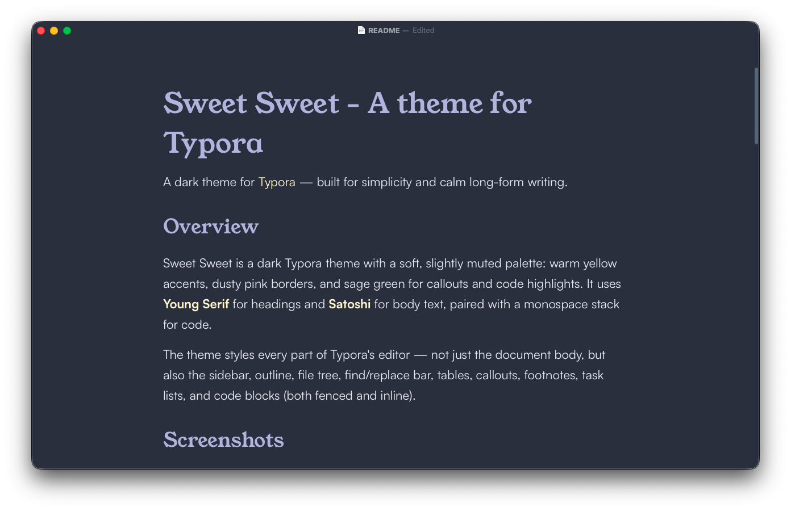

# Sweet Sweet - A theme for Typora

A dark theme for [Typora](https://typora.io) — built for simplicity and calm long-form writing.

## Overview

Sweet Sweet is a dark Typora theme with a soft, slightly muted palette: warm yellow accents, dusty pink borders, and sage green for callouts and code highlights. It uses **Young Serif** for headings and **Satoshi** for body text, paired with a monospace stack for code.

The theme styles every part of Typora's editor — not just the document body, but also the sidebar, outline, file tree, find/replace bar, tables, callouts, footnotes, task lists, and code blocks (both fenced and inline).

## Screenshots

## Features

- **Dark theme only**
- **Calm color palette** that draws inspiration from dusk.
- **Serif headings** (Young Serif) paired with a clean sans-serif body (Satoshi).
- **Code styling** across code blocks and inline code — same font, weight, size, and border treatment.
- Consistent syntax highlighting.
- **Custom bullet glyphs** for nested lists.
- **Animated task list checkboxes** — fill animates top-to-bottom when checked.
- **Styled footnotes** with accent-colored references and no jarring divider.
- **Themed find/replace bar** that matches the editor instead of falling back to system defaults.

## Installation

1. In Typora, open **Preferences → Appearance → Open Theme Folder**.
2. Copy `Sweet Sweet.css` into that folder.
3. (Optional) If you want the recommended fonts, install:
   - [Young Serif](https://fonts.google.com/specimen/Young+Serif)
   - [Satoshi](https://www.fontshare.com/fonts/satoshi)
   
   The theme falls back gracefully if these aren't installed.
4. Restart Typora.
5. Select **Themes → Sweet Sweet**.

## Recommended setup

- **Platform:** macOS (developed and tested here). Should work on Windows and Linux but isn't fully tested — please open an issue if something looks off.
- **Typora version:** designed against current stable releases. If you're on an older version, some selectors (especially for the find/replace bar) may not match.
- **Display:** dark environments. The palette is tuned for low-light reading.

## Known limitations

- Not tested on Windows or Linux. Borders, fonts, and the title bar may render differently.
- Does not include styles for Typora's Windows "unibody" title bar.

## Contributing

Issues and pull requests are welcome — especially:

- Screenshots from Windows / Linux installs.
- Reports of UI elements that fall back to default styling.
- Refinements to syntax-highlight token colors for languages you write in often.

If you're filing a styling issue, a screenshot plus the output of Web Inspector's **Computed** panel for the affected element makes diagnosis dramatically faster.

## Acknowledgements

- Built on Typora's [theme system](https://theme.typora.io).

## License

Apache-2.0. See [LICENSE](LICENSE) for details.

## Author

[Manu Panizo](www.manupanizo.com)
